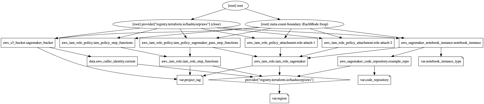

# Amazon SageMaker/PyTorch Workshop Infrastructure

Terraform code to provision resources in a new AWS Account for an Amazon SageMaker/PyTorch Workshop. Includes the use of AWS Step Functions.



## Terraform Commands

```shell
terraform init

terraform plan

terraform apply -auto-approve
```